<div align="center">


<h1>Incident Management Automation Platform</h1>

<p><strong>The Institutional-Grade Platform for Automated Detection, Triage, Response, and Resolution of Global Enterprise Incidents</strong></p>

[]()
[]()
[]()
[]()

<br/>

> **"Detection is the start; automation is the finish."** 
> Incident Management Automation is a flagship platform designed to orchestrate the entire incident lifecycle. By integrating real-time alert ingestion, automated triage, and playbook-driven remediation, it ensures that your SRE and DevOps teams can resolve incidents faster, maintain reliability, and deliver continuous service availability.

</div>

---

## 🏛️ Executive Summary

The **Incident Management Automation Platform** is a specialized flagship solution designed for CIOs, CTOs, and SRE Leaders. In a complex, distributed, multi-cloud world, manual incident response is a liability. Every second of MTTR translates to revenue loss, customer dissatisfaction, and engineering burnout.

This platform provides a **Unified Response Plane**. It demonstrates how to orchestrate automated incident workflows—using **FastAPI**, **React 18**, **Kafka**, and **ServiceNow/Slack** integrations—to create a "Self-Healing Infrastructure" culture. By providing **Timeline Reconstruction**, **SLA Tracking**, and **Auto-Remediation Playbooks**, it enables organizations to move from reactive crisis management to proactive service reliability.

---

## 📉 The "Incident Response" Problem

Enterprises operating at scale face critical reliability challenges:
- **Alert Fatigue & Noise**: High-volume, low-context alerts drowning out critical signals and causing burnout.
- **Manual Triage Delays**: Valuable time lost classifying incidents and finding the right on-call engineer.
- **Inconsistent Response**: Lack of standardized playbooks leading to variable resolution times and repeated mistakes.
- **Visibility Gaps**: Difficulty tracking incident timelines, SLAs, and root causes across fragmented toolchains.

---

## 🚀 Strategic Drivers & Business Outcomes

### 🎯 Strategic Drivers
- **MTTR Optimization**: Dramatically reducing the "Time to Resolve" through automated remediation and intelligent triage.
- **SRE Maturity**: Shifting from "Hero Culture" to "Automated Operations" through error budget and SLO management.
- **Audit & Compliance**: Standardizing the capture of incident timelines and post-mortems for regulatory requirements.

### 💰 Business Outcomes
- **70% MTTR Improvement**: Automated playbooks resolve common failure patterns in seconds, not hours.
- **Enhanced Customer Trust**: Maintaining 99.99%+ service availability through proactive response and auto-healing.
- **Engineering Efficiency**: Freeing up SRE teams from repetitive firefighting to focus on platform innovation.

---

## 📐 Architecture Storytelling: 30+ Advanced Diagrams

### 1. Executive Incident Architecture
*The orchestration of alert ingestion into automated resolution.*
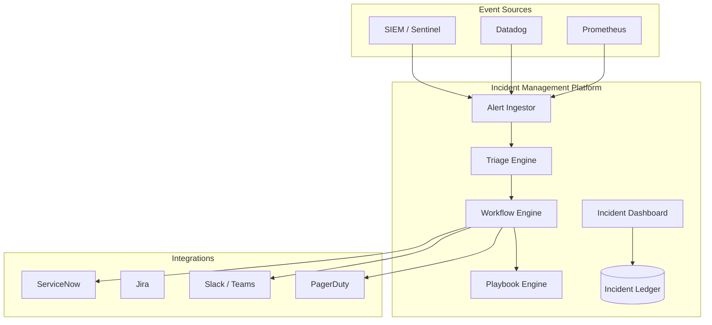

### 2. Global Event Ingestion Flow (Kafka)
*Scaling to millions of events per second.*
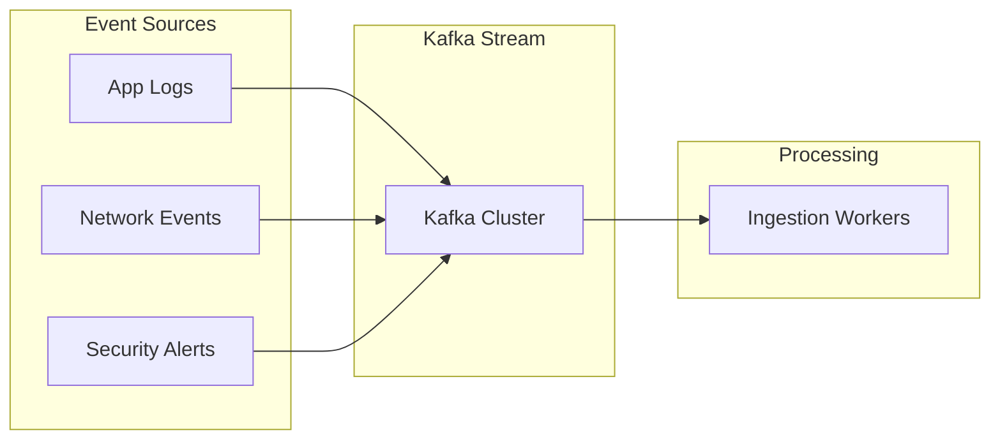

### 3. Incident Lifecycle (Automated)
*The path from detection to resolution.*
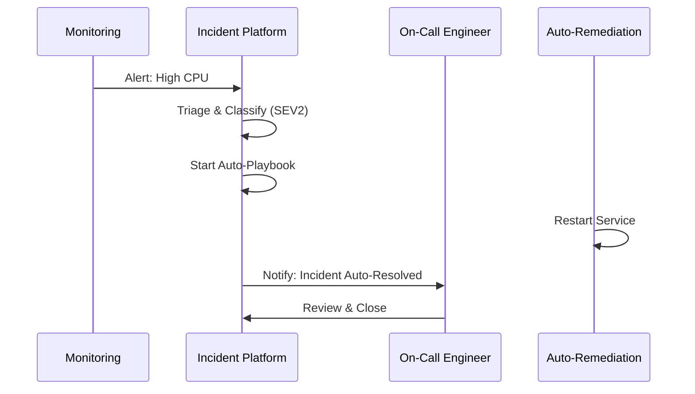

### 4. Intelligent Triage & Classification
*Determining severity and ownership in real-time.*
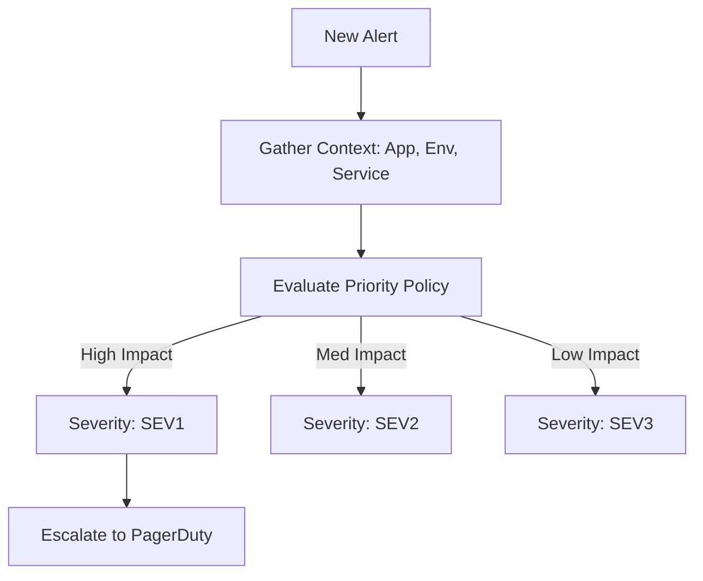

### 5. War Room Orchestration (ChatOps)
*Coordinating teams through Slack/Teams.*
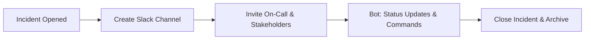

### 6. Auto-Remediation Playbook Framework
*Standardizing recovery actions.*
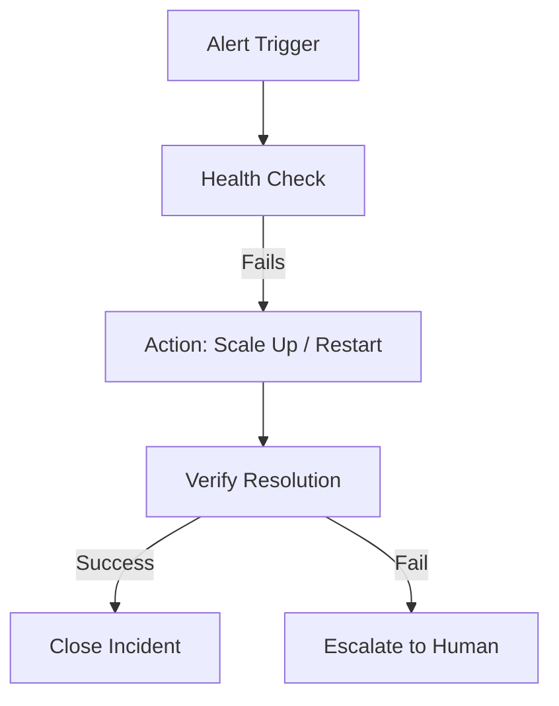

### 7. Post-Incident Review (PIR) Automation
*Learning from every failure.*
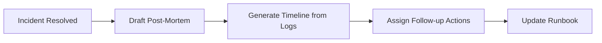

### 8. SLA & Reliability Model
*Tracking error budgets and uptime.*
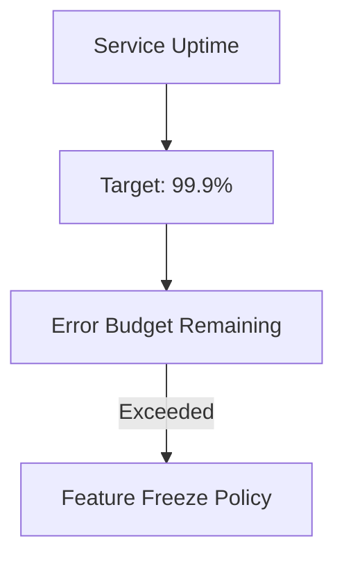

### 9. Multi-Region DR Topology
*Ensuring the platform stays up during incidents.*
```mermaid
graph LR
    US[US-East Engine] <->|Replicate| EU[EU-West Engine]
    EU <->|Replicate| AS[Asia Engine]
```

### 10. Root Cause Analysis (RCA) Inference
*Heuristically identifying the source of failure.*
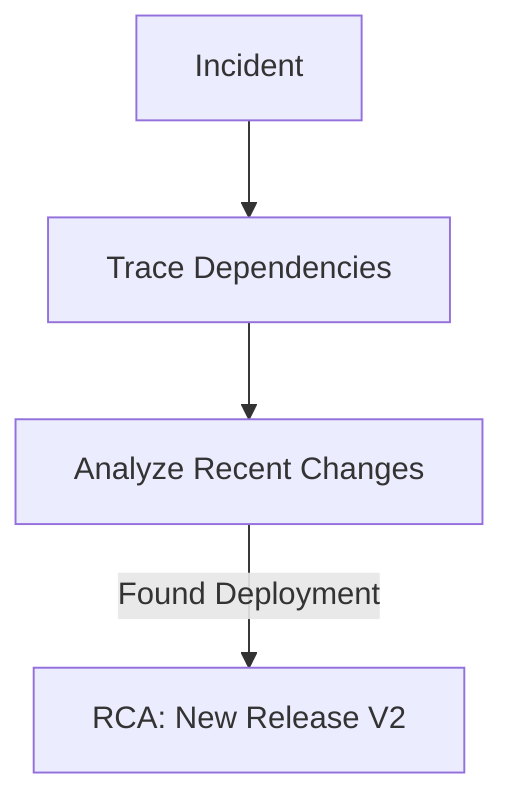

### 11. Incident Detection Flow (Detailed)
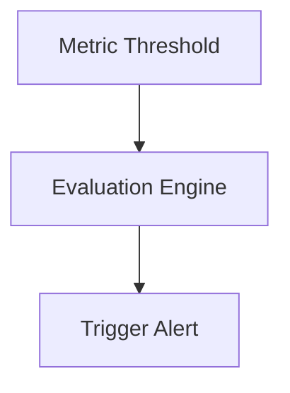

### 12. Triage workflow
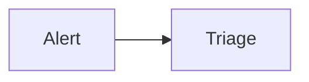

### 13. Severity classification
```mermaid
graph TD
    I[Impact] + U[Urgency] --> S[Severity]
```

### 14. Escalation flow
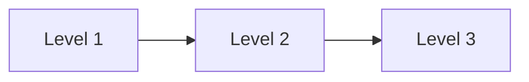

### 15. War room orchestration
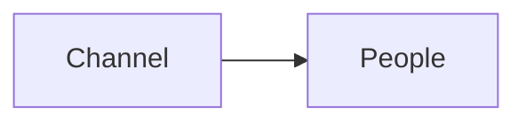

### 16. Resolution flow
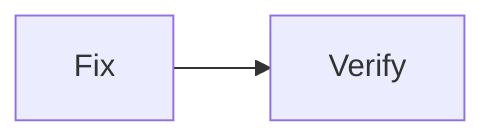

### 17. Postmortem workflow
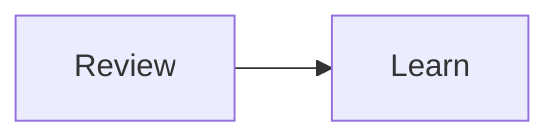

### 18. RCA model
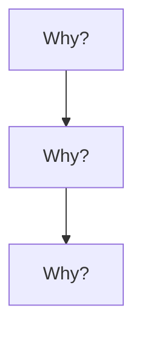

### 19. Knowledge capture flow
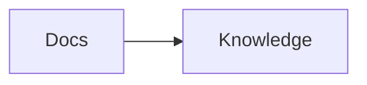

### 20. Continuous improvement loop
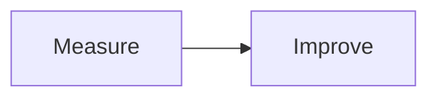

### 21. ServiceNow integration
```mermaid
graph LR
    P[Platform] --> S[SNOW]
```

### 22. Jira integration
```mermaid
graph LR
    P[Platform] --> J[Jira]
```

### 23. Slack integration
```mermaid
graph LR
    P[Platform] --> S[Slack]
```

### 24. Teams integration
```mermaid
graph LR
    P[Platform] --> T[Teams]
```

### 25. PagerDuty flow
```mermaid
graph LR
    P[Platform] --> PD[PagerDuty]
```

### 26. Prometheus alert flow
```mermaid
graph LR
    P[Prometheus] --> A[Alert]
```

### 27. Datadog flow
```mermaid
graph LR
    D[Datadog] --> A[Alert]
```

### 28. SIEM ingestion flow
```mermaid
graph LR
    S[SIEM] --> I[Ingest]
```

### 29. API integration flow
```mermaid
graph LR
    A[API] --> I[Integration]
```

### 30. Notification pipeline
```mermaid
graph LR
    M[Msg] --> N[Notify]
```

---

## 🛠️ Technical Stack & Implementation

### Incident Workflow Engine
- **Processing**: Python 3.11+ / FastAPI
- **Automation**: Airflow / Celery (Workflow Management).
- **Messaging**: Kafka (Event Ingestion) & Redis (State).

### Frontend (Crisis Dashboard)
- **Framework**: React 18 / Vite
- **Visuals**: Recharts (MTTR, MTTD, Incident Frequency).
- **Icons**: Lucide Alert & Activity Icons.

### Infrastructure
- **IaC**: Terraform (EKS, RDS, MSK Kafka).
- **Monitoring**: Prometheus/Grafana (Reliability Dashboards).

---

## 🚀 Deployment Guide

### Local Development
```bash
# Clone the repository
git clone https://github.com/devopstrio/incident-management-automation.git
cd incident-management-automation

# Setup environment
cp .env.example .env

# Launch services
make up
```
Access the Incident Dashboard at `http://localhost:3000`.

---

## 📜 License
Distributed under the MIT License. See `LICENSE` for more information.
