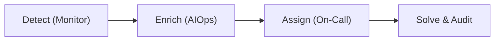
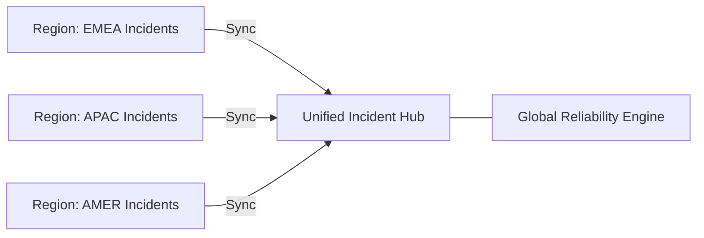
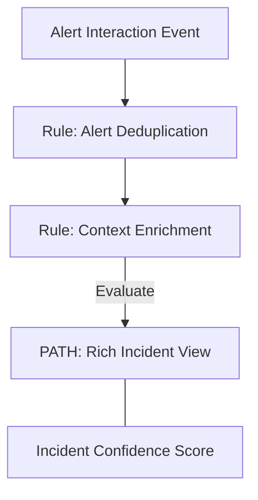
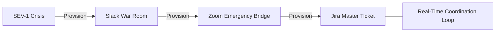
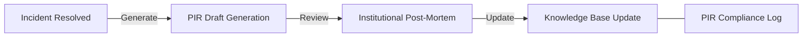
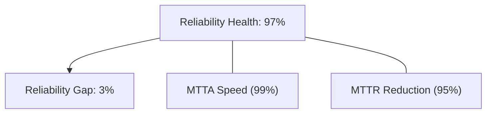
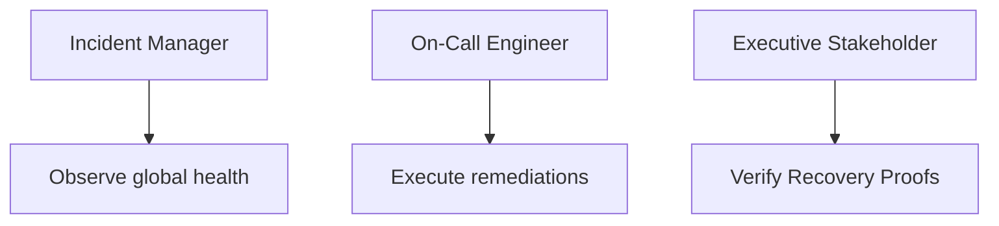
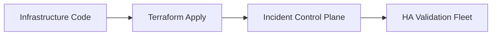
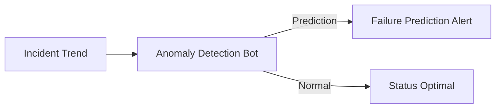
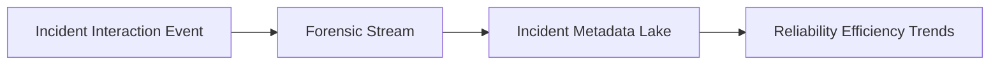

<div align="center">


<h1>Incident Management Automation</h1>

<p><strong>The Institutional-Grade Platform for Automated Detection, Triage, Response, and Resolution of Global Enterprise Incidents.</strong></p>

[]()
[]()
[]()

<br/>

> **"Detection is the start; automation is the finish."** 
> **Incident Management Automation** is an enterprise-grade platform designed to provide a secure, measurable, and highly automated foundation for global incident operations. It orchestrates the complex lifecycle of IT incidents—from automated alert enrichment and AIOps-driven triage to distributed bridge orchestration and unified post-mortem governance.

</div>

---

## 🏛️ Executive Summary

Fragmented incident detection and manual triage processes are strategic operational liabilities; lack of centralized incident orchestration is a primary barrier to organizational SRE maturity. Organizations fail to maintain service reliability not because of a lack of monitoring tools, but because of fragmented incident standards, lack of automated enrichment validation, and an inability to orchestrate incident management landing zones with operational precision.

This platform provides the **Incident Intelligence Plane**. It implements a complete **Enterprise Incident-as-Code Framework**, enabling SRE and Platform teams to manage global incident lifecycles as first-class citizens. By automating the identification of root causes through real-time telemetry analysis and orchestrating the spawning of dedicated war rooms, we ensure that every organizational failure—from critical system outages to routine service degradations—is detected by default, audited for history, and strictly aligned with institutional reliability frameworks.

---

## 📐 Architecture Storytelling: Principal Reference Models

### 1. Principal Architecture: Global Incident Management & Automation Intelligence Plane
This diagram illustrates the end-to-end flow from multi-cloud monitoring ingestion and AIOps triage to automated enrichment, war room orchestration, and institutional incident auditing.


```mermaid
graph LR
    %% Subgraph Definitions
    subgraph IncidentIngress["Multi-Cloud & Telemetry Ingress"]
        direction TB
        SRE_Metrics["Prometheus / Grafana Metrics"]
        APM_Signals["Datadog / NewRelic Alerts"]
        Log_Triggers["Elastic / Splunk Log Events"]
    end

    subgraph IntelligenceEngine["Incident Intelligence Hub"]
        direction TB
        API["FastAPI Incident Gateway"]
        AIOps_Triager["AIOps Noise & Triage Hub"]
        EnrichmentBot["Context & Log Enricher"]
        BridgeOrch["Slack / Zoom Bridge Orch"]
    end

    subgraph OperationsPlane["Distributed Response Fleet"]
        direction TB
        OnCallWorkers["On-Call & PagerDuty Sync"]
        AutoRemediators["Self-Healing Action Bots"]
        IncidentProxies["Timeline Integrity Proxies"]
    end

    subgraph OperationsHub["Institutional Incident Hub"]
        direction TB
        Scorecard["Incident Maturity Score"]
        Analytics["MTTA & MTTR Recovery Stats"]
        Audit["Forensic Incident Metadata Lake"]
    end

    subgraph DevOps["Incident-as-Code Framework"]
        direction TB
        TF["Terraform Incident Modules"]
        PredictiveBot["Failure Prediction Validator"]
        ChatOps["Incident War Room Hub"]
    end

    %% Flow Arrows
    IncidentIngress -->|1. Submit Telemetry| API
    API -->|2. Triage Incident| AIOps_Triager
    AIOps_Triager -->|3. Enrich Context| EnrichmentBot
    EnrichmentBot -->|4. Spawn War Room| BridgeOrch
    
    BridgeOrch -->|5. Execute Assignment| OperationsPlane
    OperationsPlane -->|6. Notify On-Call| ChatOps
    API -->|7. Visualize Health| Scorecard
    
    Scorecard -->|8. Track Reliability| Analytics
    Scorecard -->|9. Record Timeline| Audit
    
    TF -->|10. Provision Hub| IntelligenceEngine
    PredictiveBot -->|11. Inject Failure Risk| AIOps_Triager
    Audit -->|12. Improve Runbook| EnrichmentBot

    %% Styling
    classDef ingress fill:#f5f5f5,stroke:#616161,stroke-width:2px;
    classDef intel fill:#e8eaf6,stroke:#1a237e,stroke-width:2px;
    classDef operations fill:#e1f5fe,stroke:#01579b,stroke-width:2px;
    classDef ops fill:#ede7f6,stroke:#311b92,stroke-width:2px;
    classDef devops fill:#e8f5e9,stroke:#1b5e20,stroke-width:2px;

    class IncidentIngress ingress;
    class IntelligenceEngine intel;
    class OperationsPlane operations;
    class OperationsHub ops;
    class DevOps devops;
```

### 2. The Automated Incident Lifecycle Flow
The continuous path of an incident from initial detection (monitoring) and automated opening (ServiceNow/Jira) to active AIOps enrichment, assignment, solution, and institutional forensic auditing.


```mermaid
graph LR
    Detect["Detect (Monitor)"] --> Enrich["Enrich (AIOps)"]
    Enrich --> Assign["Assign (On-Call)"]
    Assign --> Solve["Solve & Audit"]
```

### 3. Distributed Incident Orchestration Topology
Strategically centralizing incident management across global geographic clusters and cross-functional teams, providing a unified institutional view of global service health and MTTR velocity.


```mermaid
graph LR
    EMEA["Region: EMEA Incidents"] -->|Sync| Hub["Unified Incident Hub"]
    APAC["Region: APAC Incidents"] -->|Sync| Hub
    AMER["Region: AMER Incidents"] -->|Sync| Hub
    Hub --- Logic["Global Reliability Engine"]
```

### 4. AIOps Incident Enrichment & Noise Reduction Flow
Executing complex logic for deduplicating alerts and automatically adding rich context—including relevant logs and topology maps—ensuring every organizational incident is actionable by default.


```mermaid
graph TD
    Alert["Alert Interaction Event"] --> Dedupe["Rule: Alert Deduplication"]
    Dedupe --> AIOps["Rule: Context Enrichment"]
    AIOps -->|Evaluate| Context["PATH: Rich Incident View"]
    Context --- Estimate["Incident Confidence Score"]
```

### 5. Automated Bridge & Channel Orchestration Flow
Automatically spawning dedicated Slack channels, Zoom bridges, and Jira tickets for high-severity incidents, ensuring zero-latency coordination across institutional stakeholders.


```mermaid
graph LR
    Incident["SEV-1 Crisis"] -->|Provision| Slack["Slack War Room"]
    Slack -->|Provision| Zoom["Zoom Emergency Bridge"]
    Zoom -->|Provision| Ticket["Jira Master Ticket"]
    Ticket --- Monitor["Real-Time Coordination Loop"]
```

### 6. Post-Mortem & Knowledge Base Automation Flow
Managing the lifecycle of a post-incident review, handling automated draft generation from incident timelines and updating the institutional knowledge base to prevent recurring failures.


```mermaid
graph LR
    Resolved["Incident Resolved"] -->|Generate| Draft["PIR Draft Generation"]
    Draft -->|Review| Final["Institutional Post-Mortem"]
    Final -->|Update| KB["Knowledge Base Update"]
    KB --- Audit["PIR Compliance Log"]
```

### 7. Institutional Incident Maturity Scorecard
Grading organizational performance based on key indicators: MTTA (Acknowledgment), MTTR (Resolution), and Automation Coverage Index.


```mermaid
graph TD
    Post["Reliability Health: 97%"] --> Risk["Reliability Gap: 3%"]
    Post --- C1["MTTA Speed (99%)"]
    Post --- C2["MTTR Reduction (95%)"]
```

### 8. Identity & RBAC for Incident Governance
Managing fine-grained access to incident hubs, automation triggers, and audit logs between Incident Managers, On-Call Engineers, and Executive Stakeholders.


```mermaid
graph TD
    Manager["Incident Manager"] --> Hub["Observe global health"]
    Engineer["On-Call Engineer"] --> Exec["Execute remediations"]
    Stakeholder["Executive Stakeholder"] --> Audit["Verify Recovery Proofs"]
```

### 9. IaC Deployment: Incident-as-Code Framework
Using modular Terraform to deploy and manage the versioned distribution of the incident tracking hubs, automation workers, and forensic metadata lakes.


```mermaid
graph LR
    HCL["Infrastructure Code"] --> TF["Terraform Apply"]
    TF --> Engine["Incident Control Plane"]
    Engine --> Clusters["HA Validation Fleet"]
```

### 10. AIOps Trend Analysis & Prediction Flow
Using advanced analytics to identify sudden surges in organizational failures, recurring incident patterns, or unusual prediction velocities that could result in institutional risk.


```mermaid
graph LR
    Trend["Incident Trend"] --> Analyzer["Anomaly Detection Bot"]
    Analyzer -->|Prediction| Alert["Failure Prediction Alert"]
    Analyzer -->|Normal| Pass["Status Optimal"]
```

### 11. Metadata Lake for Forensic Incident Audit
Storing long-term records of every incident opened, every automation action executed, and every post-mortem finding for institutional record-keeping, compliance auditing, and post-incident forensics.


```mermaid
graph LR
    Incident["Incident Interaction Event"] --> Stream["Forensic Stream"]
    Stream --> Lake["Incident Metadata Lake"]
    Lake --> Trends["Reliability Efficiency Trends"]
```

---

## 🏛️ Core Incident Pillars

1.  **Unified Incident Coordination**: Maximizing resilience by centralizing all incident monitoring through a single institutional plane.
2.  **Automated Triage Enrichment**: Eliminating "low-context" scenarios through proactive log and topology capture.
3.  **Sequential Resolution Intelligence**: Ensuring zero-interruption operations through dependency-aware multi-stage remediations.
4.  **Zero-Trust Automation Protection**: Automatically enforcing least-privilege triggers and rule evaluation across all incident tiers.
5.  **Autonomous Recovery Logic**: Guaranteeing availability through automated industry-specific restoration runbooks.
6.  **Full Incident Auditability**: Immutable recording of every incident timeline and post-mortem finding for institutional forensics.

---

## 🛠️ Technical Stack & Implementation

### Incident Engine & APIs
*   **Framework**: Python 3.11+ / FastAPI.
*   **AIOps Engine**: Managed Kafka (MSK) for high-velocity alert ingestion and correlation.
*   **Automation Hub**: Integration with ServiceNow, Jira, PagerDuty, and Slack APIs.
*   **Persistence**: PostgreSQL (Incident Ledger) and Redis (Live Job State).
*   **Auth Orchestrator**: Federated OIDC/SAML for least-privilege incident management access.

### Governance Dashboard (UI)
*   **Framework**: React 18 / Vite.
*   **Theme**: Dark, Indigo, Slate (Modern high-fidelity reliability aesthetic).
*   **Visualization**: D3.js for incident topologies and Recharts for recovery velocity analytics.

### Infrastructure & DevOps
*   **Runtime**: AWS EKS or Azure Kubernetes Service (AKS) for management plane.
*   **Timeline Hub**: Managed event sourcing for immutable incident timeline reconstruction.
*   **IaC**: Modular Terraform for deploying the incident landing zone and validation fleet.

---

## 🏗️ IaC Mapping (Module Structure)

| Module | Purpose | Real Services |
| :--- | :--- | :--- |
| **`infrastructure/inc_hub`** | Central management plane | EKS, PostgreSQL, Redis |
| **`infrastructure/workers`** | Distributed automation fleet | K8s Workers, Cloud APIs |
| **`infrastructure/bridges`** | Slack & Zoom Orchestrators | Webhooks, API Gateway |
| **`infrastructure/auditing`** | Forensic incident sinks | S3, Athena, Quicksight |

---

## 🚀 Deployment Guide

### Local Principal Environment
```bash
# Clone the incident platform
git clone https://github.com/devopstrio/incident-management-automation.git
cd incident-management-automation

# Configure environment
cp .env.example .env

# Launch the Incident stack
make init

# Trigger a mock alert enrichment and automated war room simulation
make simulate-incident
```

Access the Incident Dashboard at `http://localhost:3000`.

---

## 📜 License
Distributed under the MIT License. See `LICENSE` for more information.

---
<div align="center">
  <p>© 2026 Devopstrio. All rights reserved.</p>
</div>
