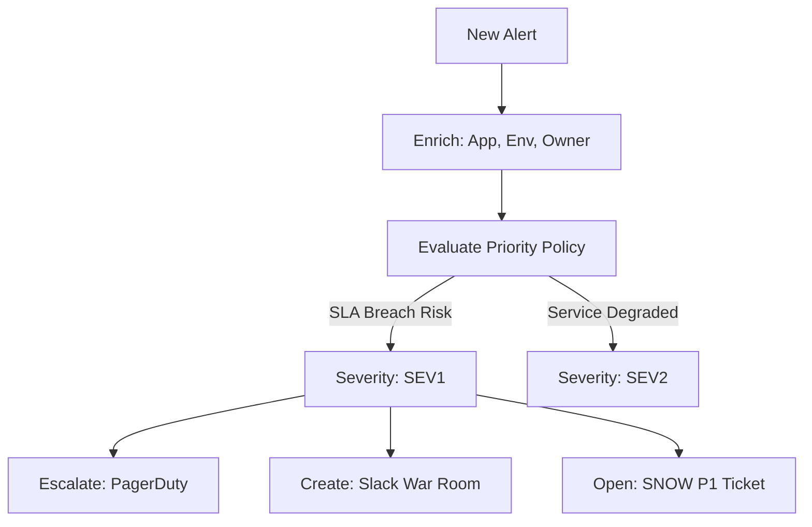
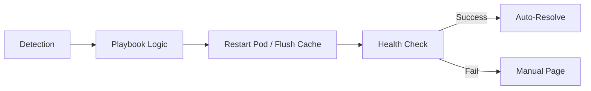
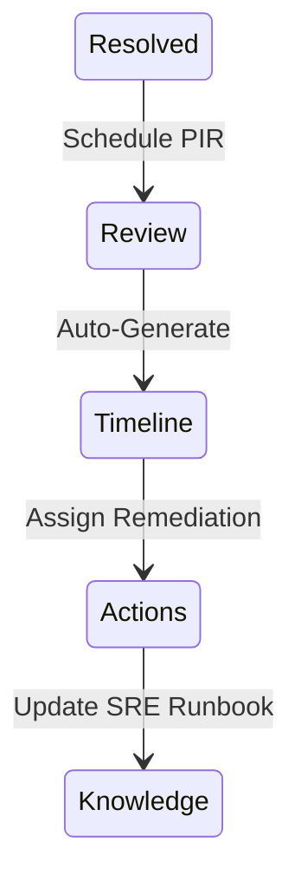

# Architecture & Incident Flow Diagrams

## 11. Automated Triage & Classification (Detailed)
*How the platform determines severity and triggers the correct response chain.*

## 13. Auto-Remediation Loop

## 20. Post-Incident Review Cycle

