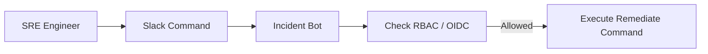
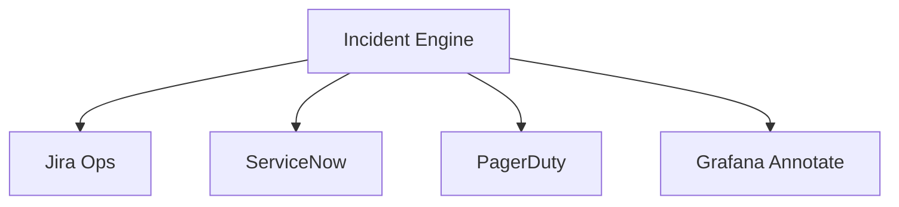
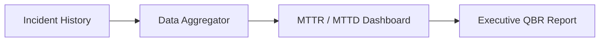

# Security & Integration Diagrams

## 31. ChatOps Security Model

```mermaid
graph LR
    User[SRE Engineer] --> Slack[Slack Command]
    Slack --> Bot[Incident Bot]
    Bot --> Auth[Check RBAC / OIDC]
    Auth -->|Allowed| Action[Execute Remediate Command]
```

## 34. Multi-Tool Integration Architecture

```mermaid
graph TD
    Platform[Incident Engine] --> Jira[Jira Ops]
    Platform --> SNOW[ServiceNow]
    Platform --> PagerDuty[PagerDuty]
    Platform --> Grafana[Grafana Annotate]
```

## 40. Incident Analytics Pipeline

```mermaid
graph LR
    Events[Incident History] --> Aggregator[Data Aggregator]
    Aggregator --> Dashboard[MTTR / MTTD Dashboard]
    Dashboard --> Report[Executive QBR Report]
```
